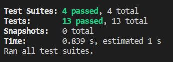
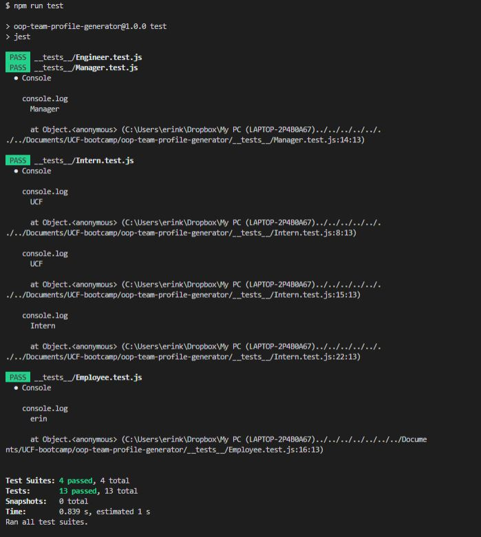
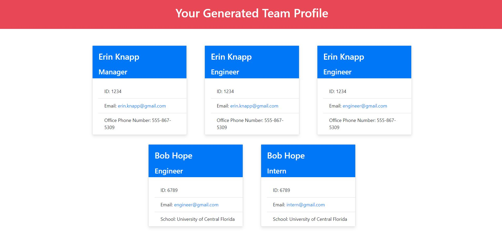

# OOP Team Profile Generator

* [Description](#description)
* [TechnologyUsed](#technology-used)
* [Installation](#installation)
* [Usage](#usage)
* [Images](#images)
* [Questions](#questions)

## Description
This application is a simple way to create teams for the workplace. Each member of the team is separated by role and includes contact information.

## Technology Used
* Node.js
* Inquirer
* Jest
* Javascript

## Installation
Clone this repository on to your local machine. Make sure Node.js is downloaded on to your machine. If it isn't you can install Node.js from here https://nodejs.org/en/. Open the terminal from the project's root and type `npm install` or `npm i` to install the necessary packages, Jest and Inquirer.

## Usage
Enter `node index.js` in the terminal and the program will run. Then you must answer the prompts. Once the prompts are answered, an HTML page will be generated to visualize the team data.

## Images

Here you can see the short and long versions of the tests, created using Jest, passing.

## Questions
For any questions, please create an issue here: https://github.com/erinknapp/oop-team-profile-generator/issues